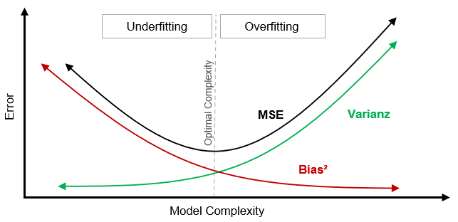
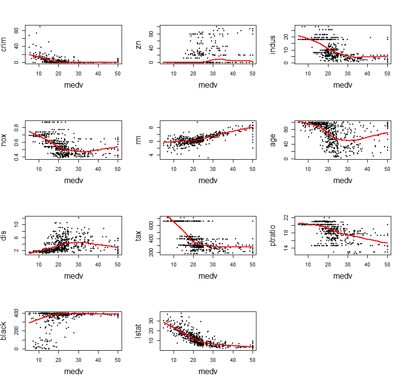

\pagenumbering{gobble}

```{r setup, include=FALSE}

### !Note that this report requires a Java version installed similar to RStudio (32-bit/64-bit)! ###
### E.g. by following this link to the Java website: https://www.java.com/de/download/manual.jsp ###

.packages <- c('tinytex','knitr','rmdwc', # LaTeX and letter count
               'MASS',                    # Data source
               'ggplot2', 'GGally',       # Plots
               'reshape2', 'lattice',     # Plots
               'rJava', 'scagnostics',    # Data structure
               'dplyr',                   # Data manipulation
               'car',                     # Test linear model requirements
               'caret',                   # Cross-validation
               'glmnet',                  # LASSO
               'pls'                      # Principle component regression
               )
.inst     <- .packages %in% installed.packages()
if(length(.packages[!.inst]) > 0) install.packages(.packages[!.inst])
.loading  <- lapply(.packages, require, character.only=TRUE)
if(any(!unlist(.loading))) stop("looks like some library did not load")
knitr::opts_chunk$set(echo = TRUE)
```

\newpage

\listoffigures
\listoftables

```{r, echo=FALSE}
rmdwc::rmdcount()
```

\newpage

\pagenumbering{arabic} 

# Introduction

There is hardly any other statistical method that has received the same level of attention in the past decades as the linear regression analysis (\citet{myers1990classical}, p.1). This is not surprising given its good statistical properties associated with the underlying ordinary least squares (OLS) estimation. Based on \citet{Gauss} those properties are known as Gauss-Markov Theorem. Hence OLS can be considered as one of the most essential estimation methods in econometrics (\citet{hayashi2011econometrics}, p.3). In fact, the use of a linear regression model can be justified by varying purposes of an analysis. One is to determine and interpret interrelations between variables by estimating the mean effect of explanatory variables on a response variable. This can be extended by presuming causal relationships. A further central intention is prediction. This is done by selecting a variable combination that yields the smallest possible error in the forecasts. Both purposes are mutually exclusive. While optimizing for prediction the estimated model coefficients and their interpretability can not be reliably determined. There exists a trade-off between interpretability and predictive accuracy across the range of linear model variants which excludes that both aims can be met at the same time (\citet{James2013}, p.24ff).

Hence prediction is considered in this report. However, minimizing the prediction error is not straightforward. In order to predict new data the model requires to be fitted to some known training data first. During that the model specification is determined and here the main problem of predictive models emerges, overfitting. That is having a model of too high complexity fitted to the training data such that it does not generalize to new data. The problem can be described via the Bias-Variance Trade-off that follows the decomposition of the Mean Squared Error (MSE) as total error measure (\citet{hastie_stat_learning}, p.24). 

{width=75%}

As Figure 1 shows a reduction in model complexity increase the bias during model fitting on training data but can result in a higher variance reduction on unseen test data which decreases the MSE (\citet{James2013}, p.36). To address overfitting in linear models the Principal Component Regression (PCR) and the Least Absolute Shrinkage and Selection Operator Regression (LASSO) as well as a stepwise regression (SR) are considered. Those modify the ordinary linear regression in order to yield a more sparse prediction model i.e. a model of lower complexity. Hence the aim of this report is to theoretically motivate the superior predictive capabilities of the sparse linear models and based on that compare the methods regarding their predictive accuracy. The ordinary linear regression (OLS) will serve as benchmark model here. Note that the Factor Analysis is neglected since the interpretability is not of interest and the Principle Component Analysis (PCA) underlying the PCR yields variance maximizing components that are well suited for prediction.

In the following second chapter the dataset is introduced, investigated and transformed for the purpose of this report. After testing the dataset for suitability for the analysis of interest, the corresponding theory as well as the methodology is presented and the analysis are conducted. The final chapter summarizes results as well as central analysis steps.


# Dataset

This report is based on the widely used Boston Housing dataset. It was introduced by \citet{HarrisonDavid1978Hhpa} and collected during the American census in 1970. The 14 variables of the dataset record the characteristics of suburbs in the Boston Standard Metropolitan Statistical Area. Each variable has 506 observations. The dataset is chosen because of the high amount of metric scaled variables which is required by the sparse models. Referred to as ```Boston```, it is part of the package ```MASS``` and hence imported from there.

```{r}
data("Boston") # Loading dataset from MASS
colnames(Boston) # Names of the 14 columns in the dataset
str(Boston[sapply(Boston,class) == "integer"]) # Non-metric variables
Boston <- Boston[,-c(4,9)] # Deletion of non-numeric columns chas and rad
cat("The amount of metric variables:", ncol(Boston[sapply(Boston,class) == "numeric"]))
```

The dummy and the categorical variable indicated by the datatyp ```int``` are not suited for the PCA. Hence they are removed. Following the target variable selection of \citet{HarrisonDavid1978Hhpa} the goals of this report will be to predict the median house price (```medv```) using several types of linear regression models.


## Association, Correlation and Data Structure

Emphasizing the response variable ```medv```, the dataset is investigated. The variables variance-covariance matrix - rounded to whole numbers - is visualized in Table 1 with variances on the diagonal.

```{r , out.width = "60%", echo=FALSE}
cov_matrix <- round(cov(Boston),0)
kable(cov_matrix, "pipe", caption = " Values of the variance-covariance matrix")
```

As bivariate statistic the covariance measures the linear association. The sign indicates a positive/negative relationship. However, the strength of the association remains opaque and values are not comparable. Hence the respective correlation coefficients are determined. Those map the values of Table 1 into the interval $[-1,1]$.

```{r fig2, fig.cap="Correlation matrix", out.width = "80%", fig.align = "center", echo=FALSE}
source("R/Cor_matrix_plot.R", local = knitr::knit_global())
```

The most explanatory variables in Figure 2 show a sufficient amount of correlation with the response variable ```medv``` of close to or greater than 0.4 in absolute terms. Among all values the correlation is the smallest for ```dis```. Therefore it is tested by the Z test of \citet{steiger1980tests}. This test is used to bypass possible problems with ties, that can occur due to repetitions in the realizations of ```dis``` and ```medv```.

```{r fig3, fig.dim = c(8, 3.5), out.width = "75%", fig.align = "center", fig.cap="Kernel density estimations for medv and dis", echo=FALSE}
par(mfrow=c(1,2))
plot(density(Boston$medv), xlab='medv', ylab='Kernel density', main='', cex.lab=1.25)
x <- seq(min(Boston$medv)-5, max(Boston$medv), by=0.1)
lines(x, dnorm(x, mean=mean(Boston$medv), sd=sd(Boston$medv)), col='red')
plot(density(Boston$dis), xlab='dis', ylab='Kernel density', main='', cex.lab=1.25)
x <- seq(min(Boston$dis)-1, max(Boston$dis), by=0.1)
lines(x, dnorm(x, mean=mean(Boston$dis), sd=sd(Boston$dis)), col='red')
```

Given the kernel density estimations and the theoretical normal distributions (red) in Figure 3 as well as the sample size, it is reasonable to approximately assume a bivariate normal distribution for the underlying random variables of ```medv``` and ```dis```. Based on this requirement the Z test is conducted.

```{r}
cor.test(Boston$dis, Boston$medv) # Test H0: Correlation is equal to 0
```

At $\alpha=0.05$ $H0$ is rejected and one can concluded that the true correlation is not equal to 0. To focus on the relationships of the explanatory variables with the target variable, scatterplots are generated with ```medv``` on the x-axis. Additionally the respective locally weighted regressions of ```medv``` on each explanatory variable are included as red lines. This highlights the underlying associations and data structures in Figure 4.

{width=85%}

The development of the red lines correspond to the findings for the variance-covariance and the correlation matrix. A negative value in the correlation matrix goes along with a overall negative development across the values of ```medv```. Based on partial linear regressions the prediction reduction error (PRE) measures can be deduced here. For metric variables those are the $R^2$ measures. In a partial regression those display the proportion of variability in ```medv``` that can be explained by the respective explanatory variable.

```{r, echo=FALSE}
R2 <- matrix(ncol = 11, nrow = 1)
colnames(R2) <- colnames(Boston)[1:11]
rownames(R2) <- "R-squared"
for (i in 1:11) {
  x <- Boston[,i]
  R2[1,i] <- round(summary(lm(Boston$medv~x))$r.squared,3)
}
kable(R2, "pipe", caption = "Partial regression R-squared with response medv")
```

The results in Table 2 are in line with earlier findings. E.g. in the correlation matrix ```rm``` and ```lstat``` had the highest and ```dis``` the lowest correlation with  ```medv```. Following the same pattern the $R^2$ takes on values in the interval $[0,1]$.
Revisiting the bivariate relationships in Figure 4, one can improve the information outcome regarding the data structure in the scatterplots by considering some of the corresponding scagnostics by \citet{wilkinson2005graph}. Those are given in Table 3.


```{r, echo=FALSE}
s <- round(scagnostics(Boston)[,56:66],2)
colnames(s) <- colnames(Boston)[1:11]
kable(s, "pipe", caption = "Scagnostics with respect to medv")
```

The data points in the scatterplots have only few dense data regions as indicated by Skewed and apart from ```tax```, the values of Clumpy show that the data points are not clustered with distance. Sparse, Convex as well as Skinny demonstrate that the data scatters have a low level of discretization and except for ```rm``` holes between the data points occur. The values of Monotonic represent Spearman’s rank correlation coefficient and are in line with Figure 2 again.


## Linear Basis Expansion

Linear regression models assume linearity in parameters. However, this is extremely restrictive and according to the red lines in Figure 4 it is more likely that the true regression function $f({x})$ is also non-linear in ${x}$ (\citet{hastie_stat_learning}, p.139f). Therefore a linear basis expansion is applied to the 11 explanatory variables. Hence potentially informative variables towards ```medv``` are generated by allowing for non-linear effects via ${x}$. Those can increase the predictive accuracy. At the same time one yields a dataset of higher dimensions that is more appropriate for the analysis of interest since sparsity becomes a more relevant factor here. The transformations are applied to each explanatory variable column $x$. With $l\not=j$ and $l,j\in\{1,\ldots,m\}$, the transformations are given by 

$$h_1(x)=x^2,\quad h_2(x)=x^3,\quad h_3(x)=\ln(x),\quad h_4(x)=\sqrt{x},\quad h_5(x^{(j)},x^{(l)})=x^{(j)}x^{(l)}$$

\newpage

At first polynomial terms up to the third order, i.e. $h_1(x)$ and $h_2(x)$, are generated from the explanatory variables of the linear basis. 

```{r}
quadratic <- sapply(Boston[1:11], function(x) x^2 )
colnames(quadratic) <- paste(colnames(Boston)[1:11], "2", sep="^")
Boston <- merge(Boston, data.frame(quadratic), by=0, all=TRUE)
Boston$Row.names <- NULL # Delete Row.names column created by merge

cubic <- sapply(Boston[1:11], function(x) x^3 )
colnames(cubic) <- paste(colnames(Boston)[1:11], "3", sep="^")
Boston <- merge(Boston, cubic, by=0, all=TRUE)
Boston$Row.names <- NULL 
```

Further non-linear transformations of each explanatory variable of the linear basis are added i.e. $h_3(x)$ the logarithm and $h_4(x)$ the square root.

```{r}
ln <- sapply(Boston[1:11], function(x) log(x) )
colnames(ln) <- paste(colnames(Boston)[1:11], "ln", sep="_")
Boston <- merge(Boston, ln, by=0, all=TRUE)
Boston$zn_ln[Boston$zn_ln == "-Inf"] = log(0.01) # avoid log(0)
Boston$Row.names <- NULL 

sqrt <- sapply(Boston[1:11], function(x) sqrt(x) )
colnames(sqrt) <- paste(colnames(Boston)[1:11], "sqrt", sep="_")
Boston <- merge(Boston, sqrt, by=0, all=TRUE)
Boston$Row.names <- NULL 
```

Lastly the dataset is expanded by the cross-products $h_5(x^{(l)},x^{(j)})$ i.e. the interaction terms between the explanatory variables of the linear basis.

```{r}
interm <- model.matrix(~(crim+zn+indus+nox+rm+age+dis+tax+ptratio+black+lstat)^2,Boston)
Boston <- merge(Boston, interm[,13:67], by=0, all=TRUE) # Only merge interactions
Boston$Row.names <- NULL 
cat("Number of variables in the dataset: ", length(colnames(Boston)))
```

In total all transformations of the linear basis expansion add 99 explanatory variables to the dataset. Hence the result is a high-dimensional data matrix $D$ with 111 variables, where sparsity is a considerable factor. Thus this expanded dataset builds the foundation for the predictive models.

\newpage


# Analysis
 
In this section the theory behind the OLS estimation of the linear regression model is illustrated. Based on this the SR, PCR and LASSO are presented as modifications of the linear regression model. This is followed by an introduction of the performance measure for predictive accuracy as well as the cross-validation method used to identify the optimal PCR and LASSO model. Accordingly, the analysis of interest is conducted in the implementation part with results being depicted and discussed.


## Theoretical Foundations

$D$ can be divided in $y=(y_1\, y_2\,\ldots\, y_n)^T\in\mathcal{R}^{n \times 1}$ denoting the response vector ```medv``` and the data matrix $(x_1\,{x}_2\,\ldots\, {x}_p)\in\mathcal{R}^{n \times p}$ with the vectors ${x}_j=(x_{1j}\,x_{2j}\,\ldots\, x_{nj})^T$, i.e. all vectors of explanatory variable realizations, where $j=(1,\ldots,p)$ . With the vector of ones $x_0$ follows the design matrix $X=(x_0\,{x}_1\,\ldots\, {x}_p)$.

### Linear and Stepwise Regression

If one now assumes that $y_i\in\mathcal{R}$ can be explained in a linear manner and sufficiently well by $x_{ij}$ with $i=(1,\ldots,n)$, then a linear regression model offers a simple way of modeling this relation. Let $\beta=(\beta_0\,\beta_1\,\ldots\,\beta_p)^T$ be the coefficient vector that describes the relationships and  $\varepsilon=(\varepsilon_1\,\ldots\,\varepsilon_n)^T$ the error vector of unsystematic deviations, then the linear regression model is then given by
$${y}={X}\beta+\varepsilon\quad\text{with}\quad\varepsilon\sim(0,\sigma^2{I_n})$$

Since the model equation is linear in $\beta_j$, the coefficient vector can be estimated with OLS and follows with
$$\hat{\beta}^{\text{OLS}}=\min_{{\beta}\in\mathcal{R}^p}\|{y}-{X}\beta\|_2^2$$
The Gauss-Markov theorem shows that, in the case of a linear model with uncorrelated as well as homoscedastic error terms and full rank of the non-random matrix $X$, the OLS estimator is the one with the smallest variance among all linear and unbiased estimators. It is given by $\hat{\beta}^{\text{OLS}}=({X}^T{X})^{-1}{X}^T{y}$ (\citet{hastie_stat_learning}, p.51f). 

One way to reduce the complexity of the OLS model is to conduct variable selection with a SR model. As predictive accuracy is of interest, the Akaike Information Criteria (AIC) is used here. It is given by 
$$AIC = 2h - 2\ln(\hat{L}) = 2h + n\ln\Big(\frac{\hat{e}^T\hat{e}}{n}\Big)$$
where $\hat{L}$ corresponds to the model likelihood, $h$ equals the number of free parameters and $\hat{e}$ is the residual vector. Only considering the direction backwards the SR model is found by the iterative detection and deletion of the variable $x_j$ such that the AIC in the regression of $y$ on the reduced $X$ is minimized. This is done until no further reduction is possible or all variables are removed and yields a model of lower complexity.

### Principal Component Regression

Given the high dimensional dataset $D$, \citet{PCA} has shown that a PCA can transform a large extent of variability contained in all explanatory variables to only few components. A linear regression based on them results in a model of reduced complexity. The PCA aims on finding the orthogonal projection $p_{{v}}:\mathcal{R}^p\rightarrow\mathcal{R},\,{x}\mapsto {x}^T{v}$ onto a one-dimensional subspace, which maximizes the variance of the projections $p_{{v}}({x_i})$ (\citet{bishop}, S.562). This takes place under a restriction that fixes the length of the vector $v$ and
$$\frac{1}{n}\sum_{i=1}^n\big(p_{{v}}({x_i})-p_{{v}}({\overline{x}})\big)^2=\frac{1}{n}{v}^T({X}-{1_n}{\overline{x}}^T)^T({X}-{1_n}{\overline{x}}^T){v}={v}^T{S_n}{v}$$
shows - with ${S_n}$ being the data covariance matrix, ${1_n}$ a $n$-dimensional vector of ones and ${\overline{x}}=n^{-1}\sum_{i=1}^n{x}_i$ the arithmetic mean of ${x}_i$ - that the corresponding maximization problem is given by 
$$\max_{{v}\in\mathcal{R}^p}{v}^T{S_n}{v}\quad \text{ subject to }\quad \|{v}\|^2_2=1$$
The first-order condition is ${S_n}{v}=\lambda{v}$ i.e. ${v}$ is the eigenvector of the eigenvalue $\lambda$ of the data covariance matrix ${S_n}$ and with the constraint $\|{v}\|^2_2=1$ follows 
$$\max_{{v}\in\mathcal{R}^p}{v}^T{S_n}{v}=\max_{{v}\in\mathcal{R}^p}\lambda\|{v}\|^2_2=\max_{{v}\in\mathcal{R}^p}\lambda.$$
The eigenvector $v$ for the greatest eigenvalue $\lambda$ is the first principal component. The second principal component $w$ and further principal components are obtained analogous, but with the additional requirement of orthogonality with respect to already identified principal components, namely ${v}^T{w}=0$ (\citet{bishop}, S.563). So ${S_n}$ is orthogonally diagonalizable as a symmetrical positive definite matrix i.e. the eigenvectors of ${S_n}$ form an orthonormal basis and are orthogonal to each other. The principal components therefore correspond to the eigenvectors of the matrix ${S_n}$. For centered data ${\overline{x}}=0$, ${S_n}=n^{-1}{X}^T{X}$ applies. 

Let ${P}=({v_1}\,\ldots\,{v_p})$ be the projection matrix according to the PCA, which columnwise contains all $p$ principal components. The PCR with the design matrix projection to the principal components is given by  
$${y}={X}{P}{\theta}+\xi={Z}\theta+\xi\quad\text{with}\quad\xi\sim(0,\sigma^2{I_n})$$
Due to the orthonormality of ${P}$ the equality ${X}\beta={X}{P}{P}^T\beta ={Z}\theta$ and thus $\hat{\beta}^{\text{OLS}}={P}\hat{\theta}^{\text{OLS}}$ applies in the case of centered data (\citet{Jolliffe}, P.169). The OLS estimation of the PCR before transformation is
$$\hat{\beta}^{\text{PCR}}={P}({Z}^T{Z})^{-1}{Z}^T{y}=\sum_{i=1}^p\lambda_i^{-1}{v_i}{v_i}^T{X}^T{y}\quad\text{with}\quad V\Big[\hat{\beta}^{\text{PCR}}\Big]=\sigma^2\sum_{i=1}^p\lambda_i^{-1}{v_i}{v_i}^T$$
The variance formula shows that principal components ${v_i}$ with low variance, i.e. with small eigenvalues $\lambda_i$, contribute strongly to a high variance of the estimator. If there is multicollinearity, the small principal components cause variance inflation (\citet{Jolliffe}, p.171). If one uses the matrix ${P_r}=({v_1}\,\ldots\,{v_r})$ instead of ${P}$ with  $r \ll p$, a variance reduction is achieved. $V[\hat{\beta}^{\text{PCR}}]-V[\hat{\beta}^{\text{PCR}}_r]$ is a positive semi-definite matrix and the estimator $\hat{\beta}^{\text{PCR}}_r$ biased. Inducing a small bias, with a relatively large reduction in variance, the PCR estimator is - in line with Figure 1 - in theory capable of better prediction performance compared to the OLS model. The PCR is performed with the package ```pls``` by \citet{MevikBjorn-Helge2007TpPP}.

### Least Absolute Shrinkage and Selection Operator Regression

In contrast to the PCR, the LASSO estimator proposed by \citet{tibshirani96regression} achieves a dimension and variance reduction through the regularization of the OLS objective function using the $\mathcal{L}_1$ norm. The OLS loss function is minimized under the constraint $\|\tilde{\beta}\|_1=\sum_{j=1}^p|\beta_j| \leqslant t$ restricting the coefficients $\tilde{\beta}=(\beta_1\,\beta_2\,\ldots\,\beta_p)^T$ , such that for the form of the LASSO estimator follows 
$$\hat{\beta}^{\text{LAS}}=\min_{\beta\in\mathcal{R}^p}\left\{\|{y}-{X}\beta\|_2^2+\lambda\|\tilde{\beta}\|_1\right\}$$
For $t>\sum_{j=1}^p|\tilde{\beta}_j|$ the constraint becomes inactive and $\hat{\beta}^{\text{LAS}}=\hat{\beta}^{\text{OLS}}$ follows. Since the $\mathcal{L}_1$ norm cannot be differentiated in the origin of the coordinates, there is no closed solution for $\hat{\beta}^{\text{LAS}}$. However, it is a convex optimization problem and can therefore be solved with iterative methods (\citet{sparsity}, p.14).
The special case of orthonormal regressors, i.e. ${X}^T{X}={I}_p$, provides a theoretical solution of the LASSO. The $\mathcal{L}_1$-Norm has a subdifferential $\frac{\partial}{\partial\beta_j}\|\beta\|_1=s(\hat{\beta}_j)$ (\citet{bubeck2014convex}, S.235), that $\forall j\in\{1,\dots,p\}$ represents either the sign for $\hat{\beta}_j\neq0$ or $[-1,1]$ for $\hat{\beta}=0$. This yields $\forall j$ elementwise  
$$\frac{\partial}{\partial\beta_j}\|{y}-{X}_j\beta_j\|_2^2+\lambda\|\tilde{\beta}_j\|_1=2\hat{\beta}^{LAS}_j-2\hat{\beta}^{OLS}_j+\lambda s(\hat{\beta}^{OLS}_j)\stackrel{!}{=}0$$
(\citet{tibshirani2013the}, S.1461). Hence the LASSO estimator is given depending on the subdifferential $s(\beta_j)$ via

$$\hat{\beta}^{\text{LAS}}_j = s\Bigl(\hat{\beta}^{OLS}_j\Bigr) \max\Bigl\{|\hat{\beta}^{OLS}_j| - \frac{\lambda }{2},0\Bigr\} =
    \begin{cases}
    \hat{\beta}^{OLS}_j + \frac{\lambda }{2}, & \text{if}\quad \hat{\beta}^{OLS}_j  < - \frac{\lambda }{2} 
    \\ 0, & \text{if}\quad \hat{\beta}^{OLS}_j \in [-\frac{\lambda }{2},\frac{\lambda }{2}]  
    \\ \hat{\beta}^{OLS}_j - \frac{\lambda }{2}, & \text{if}\quad \hat{\beta}^{OLS}_j  > + \frac{\lambda }{2}
    \end{cases}$$
Accordingly, $\hat{\beta}^{\text{LAS}}=\hat{\beta}^{\text{OLS}}$ if $\lambda=0$ and $t=0$ if $\lambda=\infty$. This result can be seen as a continuous model selection process, that reduces the dimensions over $\lambda$ by shrinking and excluding variables (\citet{hastie_stat_learning}, p.70). A standardization of the regressors is necessary because a uniform scale enables a comparable adjustment in the coefficients via some fixed $\lambda$. Determined by $s(\beta_j)$ a bias is induced in the coefficients of the OLS estimation in the direction of 0 and those are for $\hat{\beta}^{OLS}_j\in[-\frac{\lambda}{2},\frac{\lambda}{2}]$ set to 0. The model complexity decreases what avoids overfitting according to Figure 1. Again the increase in the bias by $\lambda$ can result in a disproportionate reduction in the variance. This theoretically improves the predictive quality of the model (\citet{James2013}, p.223). Since there is no general closed form solution for $\hat{\beta}^{\text{LAS}}$, the package ```glmnet``` is used with coordinate descent according to \citet{FriedmanJerome2010RPfG} to identify the model along $\lambda$ values.


## Methodology

To conduct the analysis of interest, the dataset needs to be split into a training set and a test set initially. Here the pareto principle is exploited, hence 80% are assigned to the training set and the remaining 20% to the test set with $n=n_{train}+n_{test}$. The training set is used to find the optimal PCR and LASSO models as well as the coefficients for the OLS estimate and the SR model. Based on this the predictive capabilities of these models are evaluated with the test set (\citet{hastie_stat_learning}, S.222). This distinction in sets prevents a biased estimate of the prediction error, that tends to be underestimated if the entire dataset is used (\citet{EfronBradley1983EtER}, p.316). In contrast to the OLS, the PCR and LASSO estimators provide varying estimations of the coefficient vector $\beta$ depending on a hyperparameter (\citet{James2013}, p.215). This parameter corresponds to the lagrange multiplier $\lambda$ for LASSO and the number of principal components $r$ for the PCR. Here the aim is to identify the hyperparameter that yields the optimal model. Due to the small sample size the Predicted Residual Sum of Squares (PRESS) statistic is used as model selection criterion (\citet{myers1990classical}, p.171). It coincides with the leave-one-out cross-validation of the MSE - a special case of the $k$-fold cross-validation for $k=n_{train}$ - given by
$$\text{PRESS}= \frac{1}{n_{train}}\sum_{i=1}^{n_{train}} \ \big(y_i - \hat{f}({x_{i,-i}})\big)^2$$
With $y_i$ and ${x_i}$ as observations of the training set, the notation ${x_{i,-i}}$ implies that the $i$-th observation itself is not used for fitting the model when determining the squared prediction error of the $i$-th observation. Therefore the cross-validation ensures that the performance of the candidate models is judged on the basis of unknown validation data. The model, that minimizes the PRESS, is selected. For the PCR and LASSO, the values of the PRESS criterion are computed for a sequence $(r_n)_{n\in\mathbb{N}}$ and $(\lambda_n)_{n\in\mathbb{N}}$ and the hyperparameters $r$ and $\lambda$ are selected according to the minimal PRESS statistic. The implementation is done with the package ```caret``` by \citet{kuhn2008building}.

The predictive accuracy of the estimated models is finally evaluated with the help of the test set providing new data outside the sample used for estimation (out-of-sample). This independence of the test set from the model fitting enables an estimation of the true prediction error via the calculation of the mean squared prediction error (MSPE). Analogous to the PRESS the MSPE is defined as
$$\text{MSPE} = \frac{1}{n_{test}}\sum_{i=1}^{n_{test}}\big(y_i-\hat{f}({x_i})\big)^2$$
but with $y_i$ and ${x_i}$ originating from the test set. Note that the PRESS statistic almost correspond to the MSPE, which shows that the PRESS is a well suiting model selection criterion here. Like in Figure 1 the MSPE can be decomposed into variance and the squared bias and reacts to changes in both components (\citet{efron2016computer}, p.52). Hence it is an appropriate criterion for the analysis with lower MSPE values indicating better predictive accuracy. The MSPE on the training set (in-sample), which uses $n_{train}$ observations instead of $n_{test}$, measures the degree to which the models fit and adjust to the training set. Labeled as MSE, it is calculated as measure for model overfitting along with the PRESS and the MSPE for all linear regression models i.e OLS, SR, PCR and LASSO. 


## Implementation

First, the effect of each observation $i \in (1,\dots,n)$ on the overall fit of a linear regression model estimated on the expanded Boston dataset is checked with Cook's distance \citet{cook1977detection}. This is relevant for the predictions and their accuracy because a rotation of the regression line by the incorporation of highly influential observations into the training set can change the fitted values substantially.

```{r fig5, fig.cap="Cook's distance for the expanded Boston Housing dataset", fig.align = "center", out.width = "55%", echo=FALSE}
OLS <- lm(medv~., data=Boston)
plot(cooks.distance(OLS), pch=20, ylab="Cook's distance", xlab="Observations", cex.lab=1.4, cex.axis=1.2)
abline(h=4/nrow(Boston), col="red", lty="solid" , lwd=1.5)
```

In Figure 5 several observations exceed the boundary (red) indication that highly influential observations exist. However, no deleted is done since the number of observations is small compared to the amount of features, hence a singular matrix problem for the OLS estimator is quickly induces. Thus the result of the analysis will partially depend on the observations allocation of the 80/20-Split.

The split in training and test set is randomly applied to the expanded Boston Housing dataset. The random state is fixed to ensure reproducibility of the underlying pseudo random number stream. Further the training data is divided into the explanatory variables of the design matrix $X$ and the response ```medv``` denoted as $y$.

```{r}
set.seed(1)
idx <- createDataPartition(y = Boston$medv, p=0.2, list=FALSE)
test_dat <- Boston[idx, ]
train_dat <- Boston[-idx, ]
X <- as.matrix(subset(train_dat, select=-c(medv))) # Train set coefficients
y <- as.matrix(train_dat$medv) # Train set target values
cat("The number of observations in train_dat is: ", 506-length(idx))
```

The linear basis expansion induced explanatory variables that can be explained by functional relationships, hence it is likely that due to this multicollinearity emerges in the OLS estimation. As named before this becomes problematical for prediction when the matrix $X$ is singular i.e. does not have full rank $p$.

```{r}
OLS <- lm(medv~., data=train_dat)
vif(OLS)[1:11] # Variance inflation factor for the linear basis
options(warn=-1) # Disable warnings due to multicollinearity
cat("The Rank of the matrix X is: ", qr(X)$rank)
```

Indeed the variance inflation factor for the explanatory variables of the linear basis show very severe multicollinearity with $V_j \gg 10$. However, the QR-decomposition shows that the matrix $X$ still has full rank. This is sufficient for the analysis of interest since a exact identification of coefficients is not necessary. 

```{r fig6, fig.cap="Residual diagnostics for linear regression models", fig.align = "center", out.width = "85%", echo=FALSE}
par(mfrow=c(2,2))
plot(OLS, pch=20, lty="solid" , lwd=2)
```

Figure 6 shows the residual diagnostics for the OLS estimation. The linearity assumption of the regression model is well met on the data as indicated by the Residuals vs Fitted plot. Even though of minor interest for prediction, one can see here that no heteroscedasticity problem is visible. The Normal QQ plot shows that the normality assumption is suffused, only the right tail of the empirical residual distribution is fatter than the theoretical quantiles. The Scale-Location plot yields a roughly horizontal line along the fitted values, meaning that the average magnitude of the standardized residuals remains constant. Unsurprisingly the Residuals vs Leverage plot labels some observation with high impact on the linear regression based on cook's distance which is in line with the earlier findings in Figure 5. Due to the convincing results of the residual diagnostics, further tests for homoscedasticity or normality are not necessary. The diagnostics proof that the OLS assumptions are met and linear models are suiting the data. 

### Linear and Stepwise Regression

Now the predictive accuracy of the models of interest is investigated. Initially the PRESS of the OLS model with all 110 explanatory variables is determined.

```{r}
CV_OLS <- train(medv~., data=train_dat, method="lm",
                trControl=trainControl(method="LOOCV"),
                metric="RMSE") 
PRESS_OLS <- as.numeric((CV_OLS$results[2])^2)
print(CV_OLS)
```

As expected 403 samples, each with a sample size of 402 where used. The square of the displayed RMSE yields the value of the PRESS statistic. In order to find the in-sample error, the train set ```medv``` values are predicted and the MSE i.e. the mean squared difference to the true values, is calculated. For the out-of-sample error the test set response values are predicted and the MSPE is determined again as the mean squared difference to the true values. Since the calculation and the underlying code for the MSE and MSPE does not change between the models, an illustrative chunk for the OLS model is shown here once.

```{r}
pred_OLS_train <- predict.lm(OLS, newdata=train_dat) # Predictions in-sample
pred_OLS_test <- predict.lm(OLS, newdata=test_dat) # Predictions out-of-sample

MSE_OLS <- mean((pred_OLS_train - train_dat$medv)^2) # MSE in-sample
MSPE_OLS <- mean((pred_OLS_test - test_dat$medv)^2) # MSPE out-of-sample
```

Now the OLS based regression is used as starting point of a SR model. Hence explanatory variables are eliminated backwards such that corresponding model AIC is maximized. For the resulting reduced model the PRESS is calculated as before.

```{r}
SR <- stepAIC(OLS, direction="backward", x=TRUE, trace=FALSE)
CV_SR <- train(medv~., data=SR$model, method="lm",
               trControl = trainControl(method="LOOCV"),
               metric="RMSE")
PRESS_SR <- as.numeric((CV_SR$results[2])^2)
print(CV_SR)
```

The output reveals that only 74 explanatory variables are remaining after the backwards deletion. The cross-validated coefficient of determination $R^2$ - showing the proportion of variability in ```medv``` explained by all explanatory variables - has increased compared to the OLS estimate. Again the MSE and MSPE are deduced from predictions of ```medv``` in train and test set.

```{r, echo=FALSE}
pred_SR_train <- predict.lm(SR, newdata=train_dat)
pred_SR_test <- predict.lm(SR, newdata=test_dat)

MSE_SR <- mean((pred_SR_train - train_dat$medv)^2)
MSPE_SR <- mean((pred_SR_test - test_dat$medv)^2)
```

### Principal Component Regression

In contrast to the predefined OLS model and SR, the PRESS statistic serves the PCR model in particular as a measure for the model selection with respect to all possible numbers of considered components (\citet{Jolliffe}, P.175f). To make the construction of the components scale-invariant in advance, a normalizing transformation is applied to the training set. Table 1 shows that principle components would otherwise overemphasis large scale and variance variables like ```tax```.

```{r}
CV_PCR <- train(medv~., data=train_dat, method="pcr",
                tuneLength=ncol(train_dat)-1,
                trControl=trainControl(method="LOOCV"),
                scale=TRUE, center=TRUE)
tune <- CV_PCR$results %>% dplyr::filter(ncomp==pull(CV_PCR$bestTune))
N <- tune$ncomp
PRESS_PCR <- (tune$RMSE)^2
print(tune)
```

```{r fig7, fig.cap="PCR cross-validation results by number of components", fig.align = "center", fig.dim = c(10,3.5), out.width = "80%", echo=FALSE}
source("R/PCR_plot.R", local = knitr::knit_global())
```

According to the model learning curve in Figure 7 the PRESS is minimized at 66 components. The corresponding cross-validated $R^2$ is higher than for the SR and the OLS model.

```{r}
PCR <- pcr(medv~., data=train_dat, scale=TRUE, center=TRUE, ncomp=N)
cat("The variance share explained by 66 components is: ", sum(explvar(PCR)))
```

```{r fig8, fig.cap="Screeplot solution to component selection", fig.align = "center", fig.dim = c(10,4), out.width = "80%", echo=FALSE}
prb <- princomp(scale(train_dat))
screeplot(prb, npcs = 20, main="", yaxt="n", cex.lab=1.5, cex.axis=1.5)
abline(h=1)
(cumsum(prb$sdev^2)/sum(prb$sdev^2))[1:8]
```

The 66 components explain nearly the total variation of the original explanatory variables. Hence the bias induced by the dimension reduction can be considered small. Note that the result deviates from the heuristic elbow and $90\%$ criteria depicted in the output as well as the screeplot according to \citet{cattell1966scree} in Figure 8. Those favor small numbers of components. With the 66 component PCR the MSE and MSPE are deduced from training and test set.

```{r, echo=FALSE}
pred_PCR_train <- predict(PCR, newdata=train_dat, ncomp=N)
pred_PCR_test <- predict(PCR, newdata=test_dat, ncomp=N)

MSE_PCR <- mean((pred_PCR_train - train_dat$medv)^2)
MSPE_PCR <- mean((pred_PCR_test - test_dat$medv)^2)
```

### LASSO

In the cross-validation of the LASSO model a sufficiently good $\lambda$ value is determined such that the model PRESS statistic is minimized. As the default $\lambda$ sequence is capped at 100 values and not descending fast enough in this case, a custom sequence of sufficiently small $\lambda$ values is defined. Note that $\alpha=1$ transforms the elastic net regularization that has a $\mathcal{L}_1$ and $\mathcal{L}_2$ penalty component to the model of interest by eliminating the latter. A standardization is applied to ensure a scale-invariant effect of $\lambda$ on the coefficients.

```{r}
lambdas <- seq(0.0005,0.02, length=100) # Candidate Lambda values
CV_LAS <- cv.glmnet(X, y, lambda=lambdas, 
                    alpha=1, type.measure="mse",
                    nfolds=nrow(train_dat), grouped=FALSE,
                    standardize=TRUE)
PRESS_LAS_min <- min(CV_LAS$cvm)
PRESS_LAS_se <- min(CV_LAS$cvup)
print(CV_LAS)
```

```{r fig9, fig.cap="LASSO cross-validation results by log(lambda) values", fig.align = "center", fig.dim = c(10,5), out.width = "85%", echo=FALSE}
plot(CV_LAS, xlim=c(-6.5,-4.25), ylim=c(0, 25), ylab="PRESS", type="b", cex.lab=1.5, cex.axis=1.25)
axis(side=2, at=round(seq(0, 25, by=5),1), cex.axis=1.3)
```

The output shows that 83 coefficients are non 0 for the ```min``` lambda, but possibly shrunk due to the continuous model selection. It is remarkable that the one standard error ``` 1se``` deviating lambda causes a extremely sparse model with only 48 coefficients. The learning curve of LASSO for the $\lambda$ sequence is given by Figure 9 and the first and second vertical line represent the logarithm of the ```min``` and ``` 1se``` lambda respectively. The models for both lambda values are considered for the MSE and MSPE calculation based on the predicted values of ```medv``` in- and out-of-sample.

```{r}
min <- CV_LAS$lambda.min
se <- CV_LAS$lambda.1se
LAS_min <- glmnet(X, y, alpha=1, lambda=min, standardize=TRUE)
LAS_se <- glmnet(X, y, alpha=1, lambda=se, standardize=TRUE)
``` 

```{r, echo=FALSE}
pred_LAS_train_min <- predict(LAS_min, newx=X, s=min)
pred_LAS_train_se <- predict(LAS_se, newx=X, s=se)
newX <- as.matrix(subset(test_dat, select=-c(medv)))
pred_LAS_test_min <- predict(LAS_min, newx=newX, s=min)
pred_LAS_test_se <- predict(LAS_se, newx=newX, s=se)

MSE_LAS_min <- mean((pred_LAS_train_min - train_dat$medv)^2)
MSPE_LAS_min <- mean((pred_LAS_test_min - test_dat$medv)^2)
MSE_LAS_se <- mean((pred_LAS_train_se - train_dat$medv)^2)
MSPE_LAS_se <- mean((pred_LAS_test_se - test_dat$medv)^2)
```


## Results

An overview for all measures related to predictive accuracy and for each considered model is given in Table 4. Here $N$ corresponds to the number of predictors i.e. coefficients in the respective model. The PRESS statistic takes on the highest value for the OLS model, followed by the SR PRESS value. Hence those two models do not explain the single observation sets in the cross-validation well. PCR and ```min``` LASSO perform better and equally good here. The MSE is small for the OLS model and SR indicating that the models fit the training data closely and very accurate. However, at the same time the MSPE nearly doubles compared to the MSE. This corresponds to the overfitting problem in Figure 1. Bias and MSE are low in-sample on the training set, but due to a lack of generalization the variance rises for predictions out-of-sample and the MSPE on the test set increases.

```{r , out.width = "75%", echo=FALSE}
Results <- matrix(nrow=3,ncol=5)
Results[1,] <- round(c(PRESS_OLS,PRESS_SR,PRESS_PCR,PRESS_LAS_min,PRESS_LAS_se), digits = 2)
Results[2,] <- round(c(MSE_OLS,MSE_SR,MSE_PCR,MSE_LAS_min,MSE_LAS_se), digits = 2)
Results[3,] <- round(c(MSPE_OLS,MSPE_SR,MSPE_PCR,MSPE_LAS_min,MSPE_LAS_se), digits = 2)
Results <- rbind(Results,c(length(colnames(X)),length(SR$coefficients)-1,N,CV_LAS$nzero[93],CV_LAS$nzero[41]))
rownames(Results) <- c("PRESS","MSE","MSPE","N")
colnames(Results) <- c("OLS","SR","PCR","LAS_min","LAS_1se")
kable(Results, "pipe", caption = "Measures of interest for all considered models")
```

The PCR yields better results that are even topped by both LASSO models. The MSEs of PCR and the LASSO models are higher compared to OLS and SR, but thus the generalization to new data is by far better. Note that LASSO with ```min``` lambda has the lowest MSPE here. The model complexity of the most models with high predictive accuracy is clearly reduced. Only SR remains prune to overfitting. The LASSO model with ```1se``` lambda stands out with a extremely sparse solution and with only minor drawbacks in predictive accuracy compared to the best MSPE model. Here the difference between MSE and MSPE is also very small indicating a good generalization. Overall the LASSO models show the best predictive accuracy and along that a sizable reduction in model complexity. Is the intend on optimizing the former the ```min``` lambda LASSO model is a reasonable choice whereas the sparse ```1se``` lambda LASSO model achieves the latter. Nevertheless both LASSO models clearly outperform the OLS benchmark model, SR as well as PCR.


\newpage

# Summary

The aim of this report was to compare the predictive accuracy of candidate sparse linear regression models, namely LASSO, PCR and SR, while considering OLS as benchmark model. The used performance measure was the MSPE whose Bias-Variance decomposition according to Figure 1 can explain overfitting which is a common problem in supervised learning and prediction. Mainly because of the high number of required metric scale variables, the popular Boston Housing dataset was exploited with median house price (```medv```) serving as prediction target. The bivariate statistics underlying the matrices in Table 1 and Figure 2 showed that a sufficient amount of of association and correlation between the response variable ```medv``` and the explanatory variables exists. This was confirmed by Steiger's Z Test as well as the respective PRE measures i.e. the partial regression R-squared values in Table 2. The corresponding bivariate scatterplots in Figure 4 visualized the relationships and the structure of the underlying data. The latter was refined in Table 3 by the scagnostic measures between ```medv``` and the explanatory variables. In line with the data structure findings a linear basis expansion was introduced, both to receive further relevant predictors and to attach high importance on sparsity. The OLS model on the expanded Boston Housing dataset fulfilled the OLS assumptions according to the residual diagnostics of Figure 6. Overall the dataset is well suited for linear regression models. However, Cook's distance in Figure 5 indicated that some observations have a large impact on the model fit, such that the results regarding predictive accuracy partially depend on observation allocation during the 80/20 training and test split. After specifying the SR model and finding the optimal hyperparameters via cross-validation, all considered models were fitted on the training data and measures of interest were determined by incorporating predictions on the test and training set. Here the LASSO yields the best predictive performance out-of-sample among all considered models. Inducing a small bias and achieves a disproportional reduction in variance, which minimizes the error measure MSPE and results in a remarkable reduction in model complexity. Considering the, relative to the MSPE, high value of the MSE, shows that the LASSO advantageously exploits the Bias-Variance Trade-off which here solved the overfitting problem.

However, this is not a general result and dependents on the split. Hence it is reasonable to conduct this analysis on repeated, varying and non-overlapping 80/20 splits - similar to a repeated 5-fold-cross-validation - to determine the best average accuracy or to incorporate the model instability caused by the splits via bagging ensembles, to gain further evidence for the found results that are so far in line with the literature.

\newpage